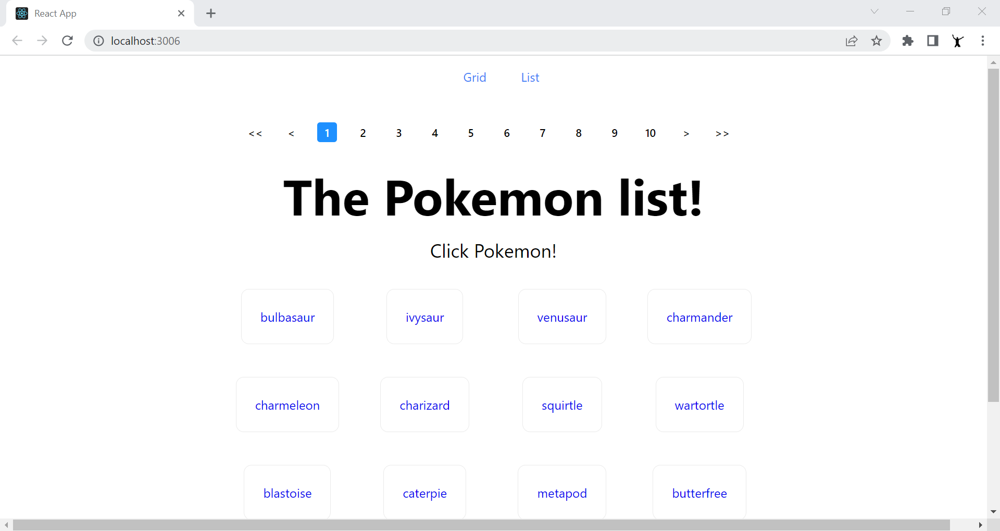
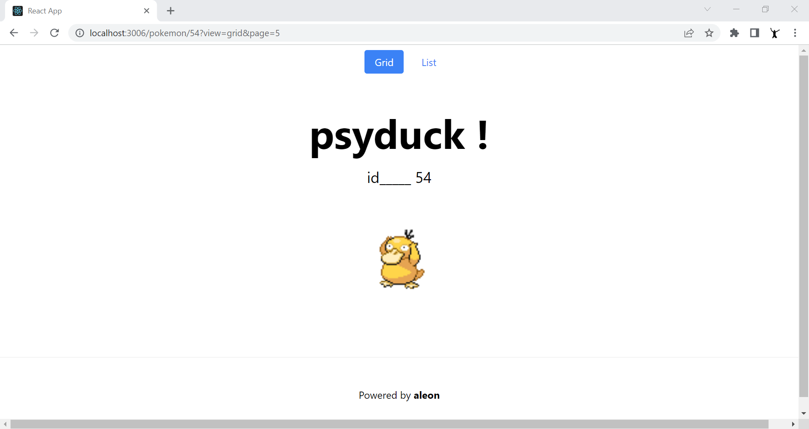

# pokemons_react

A React App example with routes, pages, components, Fetching API data, URL params, Pagination, List and Grid View and Responsive styles.

## TODO:

Utilitzant React, implementa una solució responsive, senzilla però eficaç d’un
llistat de “pokemons” amb paginació. Implementa també la pàgina del detall
del “pokemon”.

**Condicions:**
* ✅ Ha de ser amb React. Ets lliure d’usar CRA i qualsevol llibreria de React.
* ✅ Url api: https://pokeapi.co
* Implementació d’algun test. Pot ser e2e, unitari o funcional.
* ✅ Implementar possibilitat de canviar entre vista “llistat” i vista “graella” ( 4 elements per fila vista PC, 3 tablet, 2 mòvil )
* ✅ Els estils en general els deixem a la teva elecció.
* ✅ En el detall del “pokemon” amb pintar el nom i l’imatge és suficient. ( Ha de ser una nova pàgina accesible a traves de url /pokemon/<id>
* ✅ Des del detall del “pokemon” s’ha de poder tornar al llistat mantenint l’estat anterior d’aquest ( paginació i tipus de visualització )
* ✅ El projecte ha d'estar disponible en un repositori git accessible, perquè puguem veure el control de versions. A més, el README ha de contenir una breu explicació de la solució implementada i de com podem executar el projecte.

## Requeriments

🖥️ node -v
→ v14.19.3

🖥️ npm -v
→ 6.14.17

## Project Steps
- npx create-react-app pokemons_react --template typescript
- npm install react-router-dom
- npm install --save-dev @testing-library/react

## Get Started
- git clone https://github.com/aleongit/pokemons_react.git
- cd pokemons_react
- npm start
- npm run build (for create an optimized production build)
- npm run test (for tests)

